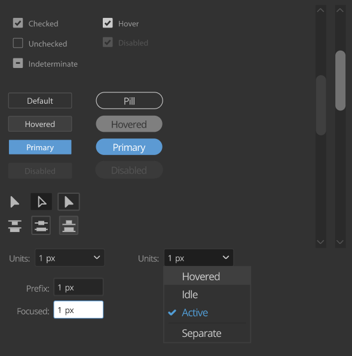

# UI Spy

Utility for writing `starlette` stylesheets to expose all conceivable UI colors of any Adobe application.

## Mock elements being colored by `starlette` CSS variables:



## The panel is reading the app theme on any changes and dynamically redressing itself to match the host's UI:


---

`starlette` will be available as an NPM package which exposes all CSS variables for use as simple as this:

```css
.buttons-pill-text {
  fill: var(--color-btn-primary-text);
}

.buttons-disabled {
  fill: var(--color-btn-disabled);
}

.buttons-disabled-text {
  fill: var(--color-btn-disabled-text);
}

.buttons-primary {
  fill: var(--color-btn-primary);
}
.buttons-primary-text {
  fill: var(--color-btn-primary-text);
}
```

No need to worry about matching various UI elements to the app theme or listening for changes -- the values of the CSS variables above will automatically change to match the user's theme.

## Stylesheet format:

Stylesheets are provided as singular JSONs per app name and theme, in the following format:

```json
[
  {
    "title": "width-scrollbar-track",
    "value": "20px"
  },
  {
    "title": "color-scrollbar-thumb-hover",
    "delta": "+34"
  },
  {
    "title": "color-input-idle-bg",
    "delta": -12
  },
  {
    "title": "color-input-focus-border",
    "hex": "#5c9ad3"
  }
  // ...
]
```

If the variable has a `delta` value (for any monochromatic color), the color is calculated as an offset from the panel's current background. This is prioritized yet overridden in any instance that the color needs a specific `hex` value, while also allowing any other `value` type (such as border widths, scrollbar differences, font-size and etc.) to be used.

## `starlette.init()` will result in exposing 46 canonical CSS variables equivalent to:

```css
/* For Illustrator's darkest theme */
:root {
  --color-bg: #323232;
  --color-default: #ccc;
  --color-text-label: #979797;
  --color-icon: #b7b7b7;
  --color-selection: #46a0f5;
  --color-divider: #2a2a2a;

  --color-btn-default: #323232;
  --color-btn-hover: #3f3f3f;
  --color-btn-border: #545454;
  --color-btn-primary: #5c9ad3;
  --color-btn-disabled: #3a3a3a;
  --color-btn-active: #1f1f1f;

  --color-btn-disabled-text: #545454;
  --color-btn-primary-text: #fff;
  --color-btn-pill-hover: #7f7f7f;
  --color-btn-pill-border: #ccc;

  --color-btn-icon-active: #2e2e2e;
  --color-btn-icon-active-border: #4b4b4b;
  --color-btn-icon-hover: #3f3f3f;
  --color-btn-icon-hover-border: #4b4b4b;
  --color-btn-toolbar-active: #1f1f1f;
  --color-btn-toolbar-active-border: #3f3f3f;
  --color-btn-toolbar-hover: #292929;
  --color-btn-toolbar-hover-border: #4b4b4b;

  --color-input-idle-bg: #262626;
  --color-input-idle-border: #3a3a3a;
  --color-input-idle-text: #ccc;
  --color-input-focus-bg: #fff;
  --color-input-focus-border: #5c9ad3;
  --color-input-focus-text: #2a2a2a;

  --color-dropdown-idle: #262626;
  --color-dropdown-active: #1e1e1e;
  --color-dropdown-hover: #3a3a3a;
  --color-dropdown-border: #3a3a3a;
  --color-dropdown-item: #323232;
  --color-dropdown-item-hover: #3f3f3f;
  --color-dropdown-item-selected: #519dd6;

  --color-checkbox-text: #979797;
  --color-checkbox-hover: #ccc;
  --color-checkbox-disabled: #545454;

  --color-scrollbar: #2a2a2a;
  --color-scrollbar-arrow: #727272;
  --color-scrollbar-thumb: #3f3f3f;
  --color-scrollbar-thumb-hover: #545454;
  --width-scrollbar-track: 20px;
  --radius-scrollbar-thumb: 20px;

  --color-tooltip-border: #767676;
}
```
